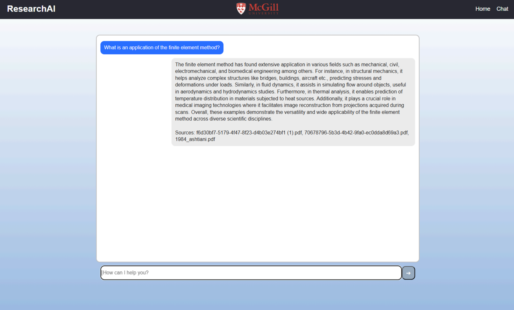

# RAG-QA-System

A full-stack **Retrieval-Augmented Generation (RAG)** based question-answering system powered by the Microsoft Phi-3 language model. This project demonstrates a modern approach to semantic search and knowledge extraction from PDF documents, featuring a FastAPI backend and an interactive React frontend.

**Developed for**: McGill University Computational Electromagnetics Research Group

---

## Features

- **Intelligent Document Retrieval**: Semantic search using sentence transformers and vector embeddings
- **RAG-Based QA**: Combines document retrieval with large language model inference for accurate, context-aware answers
- **PDF Processing Pipeline**: Automated ingestion, chunking, and embedding of PDF documents
- **Vector Database**: ChromaDB for fast similarity search and persistent storage
- **Interactive Chat Interface**: Modern React-based frontend for intuitive user interaction
- **Citation Tracking**: Maintains source references for retrieved information
- **Efficient LLM**: Uses Microsoft Phi-3-medium for resource-efficient inference
- **Map-Reduce Pattern**: Processes multiple retrieved documents for comprehensive answers

---

## Table of Contents

- [Architecture](#architecture)
- [Tech Stack](#tech-stack)
- [Prerequisites](#prerequisites)
- [Installation & Setup](#installation--setup)
- [Project Structure](#project-structure)
- [Usage](#usage)
- [Configuration](#configuration)

---

## Architecture

The system follows a **client-server architecture** with clear separation of concerns:

```
┌─────────────────────────────────────────────────────────────┐
│                     Frontend (React)                         │
│              Chat Interface + Home Page                      │
└────────────────────────┬────────────────────────────────────┘
                         │ HTTP/REST API
                         ▼
┌─────────────────────────────────────────────────────────────┐
│                    Backend (FastAPI)                         │
│  ┌──────────────┐  ┌──────────────┐  ┌──────────────────┐  │
│  │ QA Service   │  │ LLM Engine   │  │ Retrieval Chain  │  │
│  │(LangChain)   │  │ (Phi-3)      │  │ (ChromaDB)       │  │
│  └──────────────┘  └──────────────┘  └──────────────────┘  │
└────────────────────────┬────────────────────────────────────┘
                         │
        ┌────────────────┴────────────────┐
        ▼                                  ▼
    ┌─────────────────┐          ┌──────────────────┐
    │  Vector Store   │          │ Document Parser  │
    │  (ChromaDB)     │          │ (PyMuPDF4LLM)    │
    └─────────────────┘          └──────────────────┘
```

### Data Flow

1. **Ingestion**: PDF documents → Text extraction → Semantic chunking → Vector embeddings
2. **Storage**: Embeddings stored in ChromaDB with metadata and source references
3. **Query**: User question → Vectorized → Similarity search → Document retrieval
4. **Generation**: Retrieved documents + prompt → Phi-3 model → Generated answer
5. **Response**: Answer + sources → Backend → Frontend display

---

## Tech Stack

### Backend
- **Framework**: FastAPI (Python web framework)
- **LLM**: Microsoft Phi-3-medium-4k-instruct
- **RAG Framework**: LangChain with LangChain Community
- **Vector Database**: ChromaDB (vector storage & retrieval)
- **Embeddings**: Sentence-Transformers (all-mpnet-base-v2)
- **PDF Processing**: PyMuPDF4LLM, Unstructured
- **ML/NLP**: Transformers, Torch, Accelerate
- **Text Processing**: semantic-text-splitter, rich

### Frontend
- **Framework**: React 18 with TypeScript
- **Build Tool**: Vite
- **Routing**: React Router v7
- **HTTP Client**: Axios
- **Styling**: Custom CSS

### Infrastructure
- **Python Version**: 3.11.9
- **GPU Support**: CUDA 11.8 (optional, for faster inference)

---

## Prerequisites

### System Requirements
- **OS**: Linux, macOS, or Windows
- **RAM**: Minimum 8GB (16GB+ recommended)
- **Disk Space**: 10GB+ for models and data
- **GPU** : NVIDIA GPU with CUDA support for faster inference

### Software Requirements
- Python 3.11.9
- Node.js 16+ and npm
- Git

---

## Installation & Setup

### Step 1: Clone the Repository

```bash
git clone <repository-url>
cd RAG-QA-System
```

### Step 2: Backend Setup

```bash
cd backend

# Create a virtual environment (recommended)
python -m venv venv

# Activate virtual environment
# On Windows:
venv\Scripts\activate
# On macOS/Linux:
source venv/bin/activate

# Install PyTorch with CUDA support (optional, for GPU acceleration)
pip install torch==2.5.1+cu118 torchvision torchaudio --extra-index-url https://download.pytorch.org/whl/cu118

# Install project dependencies
pip install -r requirements.txt
```

### Step 3: Prepare Document Data

1. Create a data directory: `backend/data/test_data/`
2. Place your PDF files in this directory
3. Ingest documents using the CLI:

```bash
cd backend

# Ingest PDFs into ChromaDB
python cli.py ingest
```

### Step 4: Start Backend Server

```bash
cd backend

# Run the FastAPI server
python api.py
```

The API will be available at `http://localhost:8000`

### Step 5: Frontend Setup

In a new terminal:

```bash
cd frontend/react-app

# Install dependencies
npm install

# Start development server
npm run dev
```

The frontend will be available at `http://localhost:5173` (Vite default)

---

## Screenshots

### Application Demo



---

## Project Structure

```
RAG-QA-System/
├── backend/                          # FastAPI application
│   ├── api.py                        # FastAPI server and endpoints
│   ├── qa_service.py                 # RAG chain and retrieval logic
│   ├── model.py                      # LLM loading and initialization
│   ├── ingest.py                     # Document ingestion pipeline
│   ├── config.py                     # Configuration settings
│   ├── cli.py                        # Command-line interface
│   ├── requirements.txt              # Python dependencies
│   ├── data/                         # Directory for PDF documents
│   │   └── test_data/                # Test documents
│   ├── db/                           # ChromaDB storage
│   │   └── chroma/                   # Vector database files
│   └── LoRA-archived/                # Legacy LoRA fine-tuning (archived)
│
├── frontend/                         # React application
│   └── react-app/
│       ├── src/
│       │   ├── App.tsx               # Main application component
│       │   ├── Chat.tsx              # Chat interface
│       │   ├── InputBox.tsx          # User input component
│       │   ├── App.css               # Styles
│       │   ├── index.css             # Global styles
│       │   ├── main.tsx              # Entry point
│       │   ├── vite-env.d.ts         # Vite type definitions
│       │   └── assets/               # Static assets
│       ├── public/                   # Public assets
│       ├── package.json              # Node dependencies
│       ├── vite.config.ts            # Vite configuration
│       └── tsconfig.json             # TypeScript configuration
│
└── README.md                         # This file
```

---

## Usage

### Chat Interface

1. Open the frontend application in your browser (`http://localhost:5173`)
2. Navigate to the "Try Asking a Question" section
3. Enter your question in the input field
4. The system will:
   - Retrieve relevant documents from the vector database
   - Process them through the RAG pipeline
   - Generate and display a comprehensive answer

### Command-Line Interface

```bash
cd backend

# Ingest new documents
python cli.py ingest

# Query the system 
python cli.py query "Your question here"
```

---

## Configuration

All configuration settings are in [backend/config.py](backend/config.py). Key parameters:

| Parameter | Default | Description |
|-----------|---------|-------------|
| `MODEL_NAME` | `microsoft/Phi-3-medium-4k-instruct` | Language model to use |
| `EMBEDDING_MODEL` | `sentence-transformers/all-mpnet-base-v2` | Embedding model |
| `CHUNK_SIZE` | `800` | Text chunk size for documents |
| `CHUNK_OVERLAP` | `150` | Overlap between chunks |
| `NUM_RETRIEVE` | `3` | Number of documents to retrieve |
| `TEMPERATURE` | `0.4` | LLM response temperature (0-1) |
| `MAX_NEW_TOKENS` | `512` | Maximum response length |
| `CHROMA_PERSIST_DIR` | `backend/db/chroma` | Vector database location |

---